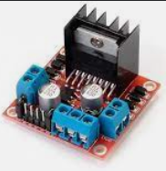
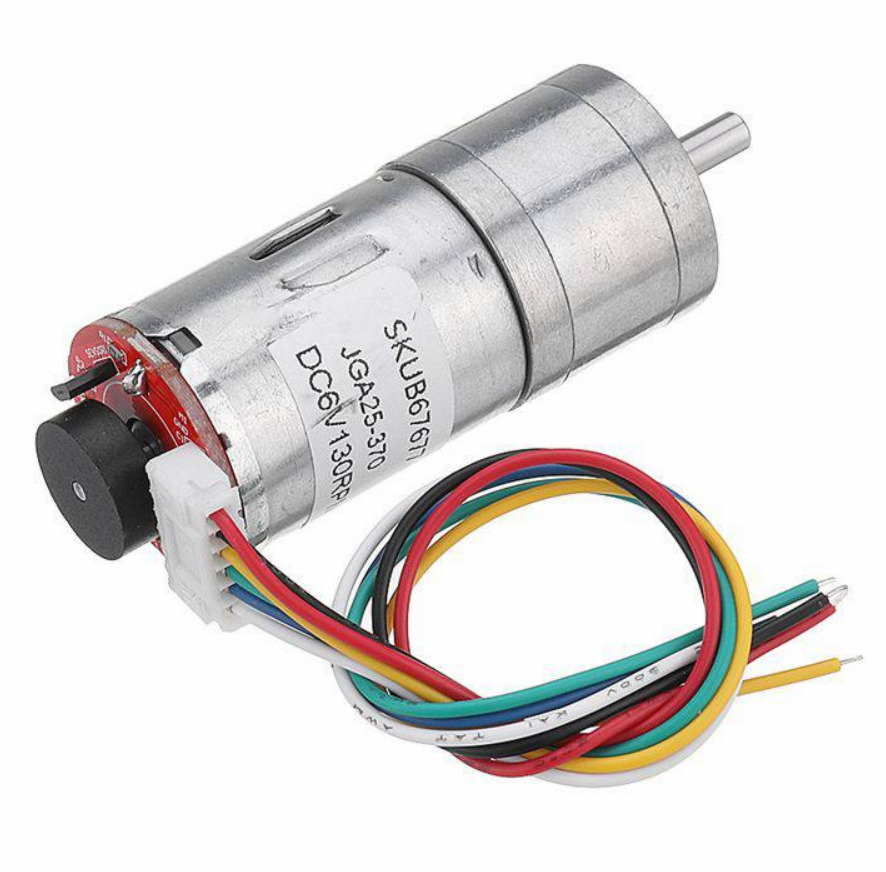
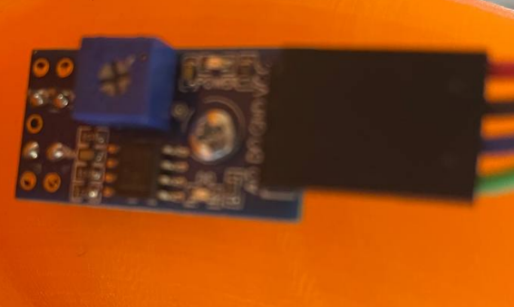
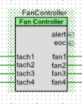

# CyberPong
CyberPong - Ping Pong Exersice Mashine

### About and Aim

This is the Ping Pong Exersice Machine that Uses 4 DC Motors and in order to shoot out ping pong balls with different spins. The goal of the project is to determine whether it is possible to make an effective Ping Pong machine and how it will curve the ball(and if it is effective).

### What is used in the Project:

**PSOC 4200 BLE(CY8CKIT-042-BLE-A to be exact)**
- programed via _PSOC Creator_

**RoHS 18152522 R DC Motors**
- Each one has VCC and GND, and an encoder with VCC, GND and Output that tells the actual motor speed.
- 4 of them are used.
- Power supply is **12V** and max RPM is ~**4350** with that power.

**L298N Motor Driver**

- 2.5 of them are used.
- 2 power the motors and the other half powers the serving motor.

**JGA25-370 DC Motow with a reducer**

- Responsible for serving the ball, can work with **5V** as well as **12V**

**Light deflection sensor**

- Determines whether the ball flew out of the machine.

**Some 12V power supply(We used S-360-12)**

### Detailed information

The goal of this project was to measure, how good such a machine can serve ping pong balls. It needs to be precise, hence the **PID Algorithm** was used in order to make motor speeds as stable as possible.

We used the built in **Fan Controller** Component in order to implement PID:

- Our coefficients turned out to be **P - 100%**, **I - 80%** and **D - 20%**. _This is still to be perfected though._

The overall program has **2 modes**:
- **Automatic**
- **Manual**

**Automatic mode** randomly shoots out balls with different spins, taken from a predefined config. It also serves the balls automatically.

**Manual mode** gives the user the possibility to set and monitor the speeds of each independant motor and control the serving.

### Contributors

- [Ostap Trush](https://github.com/Adeon18)
- [Olexiy Hoev](https://github.com/alexg-lviv)

